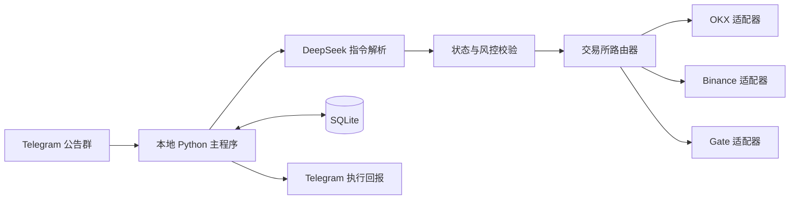
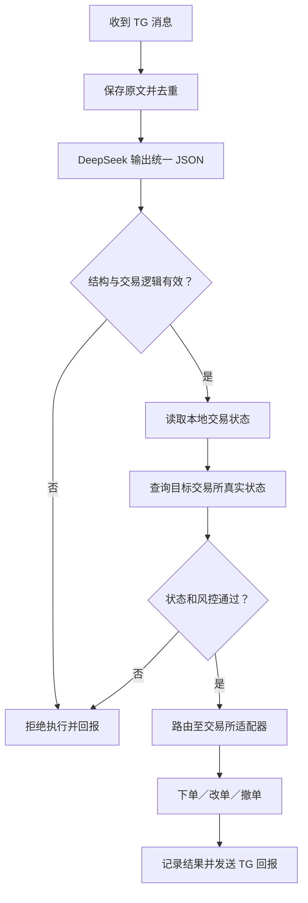
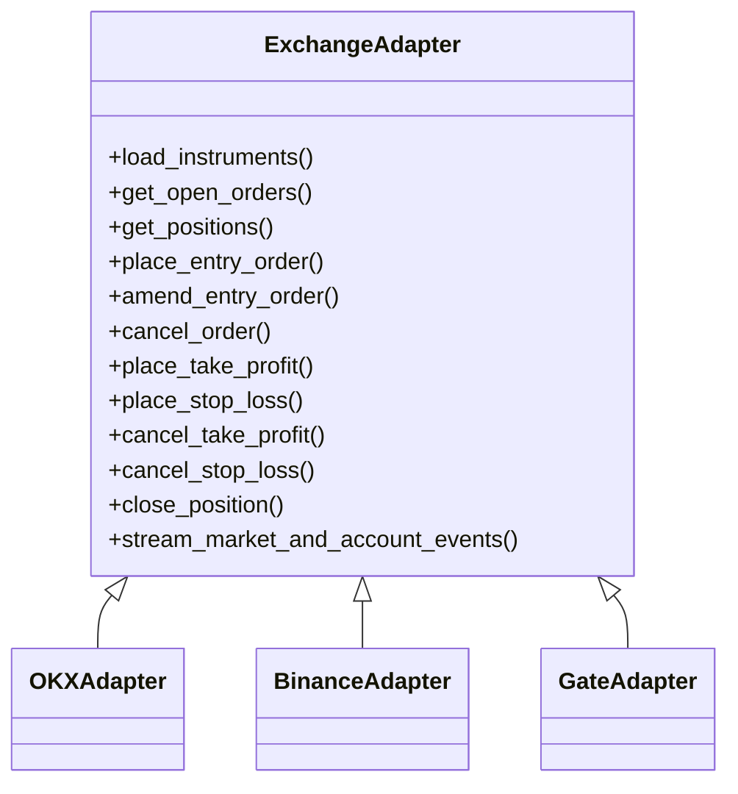
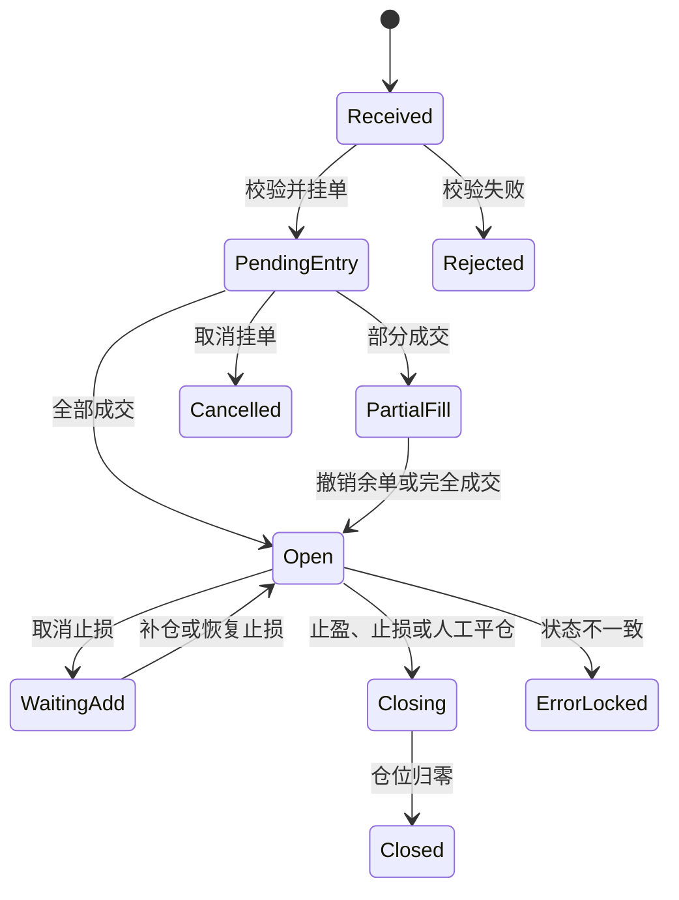

# TG 公告群 × DeepSeek × 多交易所自动交易系统

## 1. 项目目标

在一台本地 Windows 或 Linux 电脑上手动运行交易程序，持续读取指定 Telegram 公告群消息，使用 DeepSeek API 将自然语言转换为结构化交易指令，经确定性规则与风险校验后，在以下交易所(实盘+模拟盘)执行：

- OKX
- Binance
- Gate

系统不使用云服务器，不设置开机自动启动。程序关闭后，本地动态策略停止运行，但已经提交到交易所的订单仍由交易所管理。

> 本文默认交易产品为 USDT 本位永续合约。现货、币本位合约和期权不纳入第一版。

## 2. 最精简技术架构



主程序由以下七个模块组成：

1. Telegram 长轮询监听器；
2. DeepSeek 指令解析器；
3. 确定性校验与风控模块；
4. 交易状态管理器；
5. 交易所路由器与三个交易所适配器；
6. 行情、订单、仓位及自动保本监控器；
7. SQLite 数据与本地日志模块。

## 3. 技术选型

| 项目 | 精简方案 |
|---|---|
| 开发语言 | Python 3.10+ |
| 并发模型 | `asyncio` |
| Telegram | Bot API 长轮询；无法加入目标频道时再评估用户客户端方案 |
| 自然语言解析 | DeepSeek API（`deepseek-chat`） |
| 解析输出 | 严格 JSON Schema |
| OKX/Binance/Gate | 各自 REST API + WebSocket |
| 本地数据库 | SQLite，启用 WAL 模式 |
| 精确数值 | Decimal，禁止使用浮点数处理价格和数量 |
| 配置 | YAML + `.env` |
| 日志 | JSON Lines 滚动日志 |
| 启动方式 | 用户手动启动和关闭 |
| 部署 | 本地原生运行；无需服务器、Redis、Docker和管理后台 |

## 4. 核心处理流程



系统启动时不执行 Telegram 积压的历史交易信号，只处理本次启动之后收到的新消息；但必须读取三家交易所已有的挂单和仓位，用于恢复监控并防止误操作。

人工指令必须包含完整交易编号（如 `BINANCE-ETH-USDT-PERP-LONG-20260915-001`）。系统只在编号、交易所、合约、方向及远程订单/仓位均一致时执行：未成交交易可改价或撤单；已开仓交易可取消或恢复止损；“市价平仓”必须明确写出。无法唯一关联时安全拒绝，不按币种猜测目标交易。

## 5. DeepSeek 指令解析

DeepSeek 只负责理解文字并生成交易意图；交易所密钥仅由本地程序读取，模型不能直接调用交易所 API。当前默认模型为 `deepseek-chat`，通过 `DEEPSEEK_API_KEY` 鉴权。

`codex_parser.py` 为停用的备用解析器，不属于默认运行链路。

示例公告：

```text
ETH2490-80附近多 目标2519 2549
浮盈一半做保本动作 止损2455
交易所 Binance
```

统一输出示例：

```json
{
  "command_id": "tg-12345-678",
  "command_type": "OPEN_POSITION",
  "exchange": "BINANCE",
  "market_type": "USDT_PERPETUAL",
  "base_asset": "ETH",
  "quote_asset": "USDT",
  "side": "LONG",
  "entry": {
    "type": "RANGE",
    "low": "2480",
    "high": "2490"
  },
  "take_profits": ["2519", "2549"],
  "stop_loss": "2455",
  "breakeven": {
    "trigger_ratio": "0.50",
    "profit_price_ratio": "0.01"
  },
  "confidence": "0.98",
  "ambiguities": []
}
```

执行前必须满足：

- `exchange`只能为 `OKX`、`BINANCE` 或 `GATE`；
- 交易所未写明时，只能使用配置中的默认交易所，且在回报中明确提示；
- 币种必须位于交易白名单；
- `ambiguities`必须为空；
- 置信度必须达到配置阈值；
- 多单满足止损低于进场、止盈高于进场；空单相反；
- 缺少方向、价格、仓位数量或风险参数时不得下单；
- 同币种存在多笔交易时，修改指令必须包含唯一交易编号。

## 6. 统一交易所适配层

业务层不得直接调用任何交易所SDK或API。所有差异由适配器处理。



### 6.1 统一业务对象

系统内部只使用统一字段：

| 统一字段 | 含义 |
|---|---|
| `exchange` | 目标交易所 |
| `instrument_key` | 内部统一交易标识，如 `ETH/USDT:PERP` |
| `exchange_symbol` | 交易所实际合约代码 |
| `position_side` | `LONG`或`SHORT` |
| `order_side` | `BUY`或`SELL` |
| `order_type` | `LIMIT`、`MARKET`、`STOP`、`TAKE_PROFIT` |
| `reduce_only` | 是否只减仓 |
| `quantity` | 规范化后的下单数量 |
| `price` | 按交易所精度规范化后的价格 |
| `client_order_id` | 系统生成的幂等订单编号 |

### 6.2 三家交易所差异处理

| 差异 | 处理方式 |
|---|---|
| 合约代码不同 | 启动时读取产品信息并建立内部代码映射 |
| 价格精度不同 | 按 tick size 向合法价格取整 |
| 数量单位不同 | 适配器处理币数量、张数及合约乘数 |
| 最小数量/金额不同 | 下单前读取并验证交易规则 |
| 仓位模式不同 | 启动时检查单向/双向模式是否与配置一致 |
| 保证金模式不同 | 显式传入逐仓/全仓，不使用隐式默认值 |
| 止盈止损接口不同 | 对外保持统一操作，内部转换成各家参数 |
| WebSocket事件格式不同 | 转换为统一订单、成交和仓位事件 |
| 错误码不同 | 转换成统一错误类型并保留原始响应 |

严禁简单地把同一价格和数量参数原样发送给三家交易所。

## 7. 交易所选择方式

支持三种配置模式：

### 模式A：公告指定交易所

```text
【开仓】
交易所：OKX
币种：ETH
方向：多
进场：2480-2490
止盈：2519,2549
止损：2455
```

### 模式B：本地默认交易所

公告没有写交易所时，系统会向默认目标中已成功初始化的交易所分别下单：

```yaml
default_exchanges: [OKX, BINANCE, GATE]
```

任一交易所下单失败不会自动撤销其他交易所已提交的订单；执行报告会逐家列出成功、失败或因凭据/初始化问题而跳过的原因。旧版 `default_exchange: OKX` 配置仍兼容，等价于只使用 OKX。

### 模式C：多交易所同步执行

使用 `default_exchanges` 后，未指定交易所的开仓公告会按列表广播。每家交易所均使用自己的账户权益、杠杆上限和风控配置计算仓位，并生成独立交易编号；任何一家失败都不会自动撤销其他已提交订单。

## 8. 交易状态机



唯一交易编号应包含交易所：

```text
BINANCE-ETH-USDT-PERP-LONG-20260914-001
```

只有当“交易所 + 合约 + 方向 + 交易编号”全部匹配时，才允许修改订单。

## 9. 自动保本

保本计算以目标交易所返回的实际平均成交价为基准。

多单：

```text
触发价 = 持仓均价 + (最终止盈 - 持仓均价) × 50%
新止损 = 持仓均价 × 1.01
```

空单：

```text
触发价 = 持仓均价 - (持仓均价 - 最终止盈) × 50%
新止损 = 持仓均价 × 0.99
```

监控器通过目标交易所WebSocket获取价格。触发后需再次读取真实仓位和保护订单，再撤销或修改旧止损。每笔交易只能自动触发一次；多单止损只能向上移动，空单止损只能向下移动。

本地程序退出后，自动保本监控停止，因此初始止损和止盈应尽可能提交到交易所端，不能只保存在本地。

## 10. SQLite 数据设计

| 表 | 主要内容 |
|---|---|
| `telegram_messages` | 原始消息、消息版本、接收时间和解析结果 |
| `trade_instances` | 交易所、币种、方向、唯一交易编号和状态 |
| `orders` | 交易所订单号、客户端订单号、价格、数量和状态 |
| `positions` | 交易所、实际数量、平均成本和最新快照 |
| `commands` | 开仓、改单、撤单、补仓及保本指令 |
| `exchange_events` | 三家交易所WebSocket原始事件 |
| `audit_logs` | API参数摘要、修改前后数据和执行结果 |

SQLite启用WAL模式；所有订单状态写入必须在短事务中完成。交易所是订单与仓位的最终事实来源，SQLite用于关联消息、恢复业务状态和审计。

## 11. 本地项目结构

```text
tg-multi-exchange-trader/
├── main.py
├── telegram_client.py
├── deepseek_parser.py
├── codex_parser.py              # 停用的备用解析器
├── validator.py
├── risk_manager.py
├── state_manager.py
├── exchange_router.py
├── exchanges/
│   ├── base.py
│   ├── okx.py
│   ├── binance.py
│   └── gate.py
├── monitor.py
├── breakeven_strategy.py
├── database.py
├── config.yaml
├── .env
├── trading.db
└── logs/
```

## 12. 手动启动与退出

### 启动

1. 用户手动运行程序；
2. 加载本地配置和密钥；
3. 连接 DeepSeek API 和 Telegram；
4. 分别连接启用的交易所；
5. 读取交易产品规则；
6. 查询三家交易所挂单与仓位；
7. 与SQLite对账；
8. 对账正常后开始接收新指令。

某一家交易所连接失败时，应单独禁用该交易所；不能影响其他交易所已有仓位的监控。若失败交易所存在未确认的本地仓位，则必须发出高优先级告警。

### 退出

1. 停止接收新开仓指令；
2. 等待正在执行的API操作完成；
3. 保存Telegram偏移量和交易状态；
4. 关闭三家交易所WebSocket；
5. 正常退出。

退出程序默认不平仓、不撤销交易所端止盈止损，但必须明确提醒用户本地动态保本已经停止。

## 13. 最低安全要求

- 三家API Key都关闭提现权限并绑定固定IP（如交易所支持）；
- 每家交易所单独配置最大仓位和最大杠杆；
- API密钥只保存在本机`.env`或系统密钥库，不进入日志；
- 每条Telegram消息去重，防止重复下单；
- 每个订单使用唯一客户端订单编号；
- API请求超时后先查询订单结果，禁止立即重复下单；
- 止盈止损和平仓订单必须只减仓；
- 部分成交后立即保护已成交仓位；
- 取消止损和补仓必须包含明确确认及交易编号；
- WebSocket断线时暂停依赖实时价格的策略；
- 本地状态与交易所不一致时进入`ERROR_LOCKED`，禁止自动修改；
- 保留一键禁止新开仓功能，但继续维护已有仓位；
- 第一版先连接三家的模拟盘或测试环境，再进行小额实盘。

## 14. 官方接口资料

- [Telegram Bot API](https://core.telegram.org/bots/api)
- [OKX API](https://www.okx.com/docs-v5/en/)
- [Binance USDⓈ-M Futures API](https://developers.binance.com/docs/derivatives/usds-margined-futures/general-info)
- [Gate API v4](https://www.gate.com/docs/developers/apiv4/en/)

## 15. 最终架构结论

本系统保持一个本地 Python 项目，不使用服务器和开机自启。Telegram 通过长轮询提供消息，DeepSeek 将自然语言转换成统一交易 JSON，确定性校验器负责安全审查，交易所路由器再将指令交给 OKX、Binance 或 Gate 适配器。三家交易所的合约代码、精度、数量单位、仓位模式和止盈止损差异全部封装在适配层；SQLite 保存本地状态和审计记录，WebSocket 负责行情、成交及仓位监控。

> 自动交易具有实际资金风险。DeepSeek 解析结果不得绕过规则校验直接下单，正式运行前必须完成历史消息回放、模拟环境验证和小额实盘测试。
