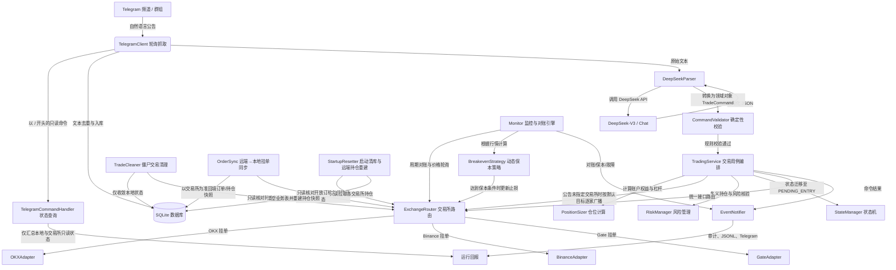

# CryptoTrade 代码架构与功能全景图 (CodeMap)

本文档系统性地梳理了 **CryptoTrade** 项目的整体架构设计、模块划分、数据流向、核心业务逻辑以及各源码文件的详细职责，作为代码库的权威索引与开发指南。

---

## 1. 架构总览 (Architecture Overview)

CryptoTrade 是一个由 Telegram 公告/频道信号驱动的多交易所（OKX、Binance、Gate）永续合约自动化交易与风险管理系统。

### 1.1 系统核心数据流向



---

## 2. 模块与文件索引 (Module & File Index)

### 2.1 核心入口与应用层

| 文件 | 核心类 / 函数 | 职责与功能说明 |
| :--- | :--- | :--- |
| [`main.py`](file:///f:/projects/CryptoTrade/main.py) | `Application`, `async_main`, `main` | **程序主入口**：负责初始化数据库、多交易所路由、监控器、DeepSeek 解析器与 Telegram 客户端；在启动对账前先执行 `StartupResetter`（每次启动清空本地业务表并按远端持仓重建快照）；支持 `--dev` 开发测试参数；捕获退出信号并优雅停机。 |
| [`dev_runner.py`](file:///f:/projects/CryptoTrade/dev_runner.py) | `run_dev_test` | **开发者测试套件**：支持通过 `python main.py --dev` 调试 DeepSeek API 连通性、打印原始返回与结构化实体，并端到端完成开仓。它复用真实的 `ExchangeRouter`：**已配置凭据的交易所会真实下单**（缺凭据的目标仅提示跳过），因此 `--dev` 是当前唯一能暴露真实交易所接口拒单的常规手段（见 §6.1）。 |
| [`settings.py`](file:///f:/projects/CryptoTrade/settings.py) | `Settings`, `_load_dotenv` | **配置管理与密钥隔离**：轻量读取 `.env` 环境变量与 `config.yaml` 配置文件，提供强类型配置属性访问。 |
| [`exchanges/credentials.py`](file:///f:/projects/CryptoTrade/exchanges/credentials.py) | `credentials` | **环境凭据隔离**：严格按交易所模式读取 `*_DEMO_*`、`*_TESTNET_*` 或 `*_LIVE_*` 变量，允许同一 `.env` 保存两套凭据而不混用。 |
| [`app_logging.py`](file:///f:/projects/CryptoTrade/app_logging.py) | `configure_logging`, `JsonlFormatter` | **结构化日志系统**：配置控制台与文件日志输出，记录结构化 JSONL 运行轨迹。 |
| [`notifications.py`](file:///f:/projects/CryptoTrade/notifications.py) | `EventNotifier` | **运行通知中心**：将启动对账、命令结果、保本和保护单故障同步写入审计日志、JSONL 与 Telegram 回报。 |

---

### 2.2 大模型解析与业务校验层

| 文件 | 核心类 / 函数 | 职责与功能说明 |
| :--- | :--- | :--- |
| [`deepseek_parser.py`](file:///f:/projects/CryptoTrade/deepseek_parser.py) | `DeepSeekParser`, `command_from_json`, `_extract_json` | **【当前默认解析器】**：通过官方 DeepSeek API 调用 `deepseek-chat` 模型，将自然语言交易公告解析为无歧义的 `TradeCommand` 结构化指令。 |
| [`codex_parser.py`](file:///f:/projects/CryptoTrade/codex_parser.py) | `CodexParser`, `resolve_command` | **【备用解析器】**：通过本机安装的 Codex CLI 子进程进行交易公告识别（已停用，代码保留备用）。 |
| [`validator.py`](file:///f:/projects/CryptoTrade/validator.py) | `CommandValidator`, `ValidationError` | **确定性业务校验器**：任何大模型输出必须经过此层校验。检查交易所白名单、币种白名单、置信度阈值、多空进场价/止盈止损逻辑合理性等。 |

---

### 2.3 交易执行、资金与风控层

| 文件 | 核心类 / 函数 | 职责与功能说明 |
| :--- | :--- | :--- |
| [`trading_service.py`](file:///f:/projects/CryptoTrade/trading_service.py) | `TradingService`, `_execute_default_exchanges`, `_place_binance_pending_protection` | **交易用例编排层**：负责指令幂等落库、账户权益获取、动态名义仓位计算、风险检查、进场限价挂单，以及基于 `trade_id` 远端核对的改挂单、撤单、止损恢复和市价平仓。公告未指定交易所的开仓指令会按 `trading.default_exchanges` **逐交易所独立广播**（子指令编号形如 `<command_id>-OKX`，各自幂等与审计），单家失败不阻断其余交易所，并在回报中标注跳过原因。 |
| [`position_sizer.py`](file:///f:/projects/CryptoTrade/position_sizer.py) | `PositionSizer` | **资金管理与仓位计算**：根据配置的保证金比例（默认账户权益 2%）与杠杆倍数（默认 100x）计算实际开仓标的数量。 |
| [`risk_manager.py`](file:///f:/projects/CryptoTrade/risk_manager.py) | `RiskManager`, `RiskExceededError` | **风控检查**：对指令名义价值进行上限校验（如不得超过账户权益的 2 倍），超出即熔断拒绝。 |
| [`breakeven_strategy.py`](file:///f:/projects/CryptoTrade/breakeven_strategy.py) | `calculate_breakeven`, `should_trigger`, `stop_only_improves` | **动态保本策略计算**：计算盈利进度达 50%（或自定义比例）时的触发价格，并将止损单动态抬升/下移至进场价上方 1% 处锁定利润。 |
| [`state_manager.py`](file:///f:/projects/CryptoTrade/state_manager.py) | `StateManager` | **交易状态机管理**：管理单笔交易在生命周期中的状态流转（`RECEIVED` $\to$ `PENDING_ENTRY` $\to$ `OPEN` $\to$ `CLOSED` 等）。 |
| [`trade_cleanup.py`](file:///f:/projects/CryptoTrade/trade_cleanup.py) | `TradeCleaner`, `CleanupReport`, `run_cleanup`, `main` | **僵尸交易清理**：收敛因失败或中断而卡住的本地交易记录（CLI：`py trade_cleanup.py [--unlock] [--dry-run]`）。**只写本地数据库，绝不下单、撤单或平仓**；默认清理「无活动订单」的未成交交易，`ERROR_LOCKED` 需显式 `--unlock` 且必须在确认远程无持仓、无挂单后才解除，否则跳过并说明原因。 |
| [`order_sync.py`](file:///f:/projects/CryptoTrade/order_sync.py) | `RemoteOrderSync`, `OrderSyncReport`, `run_order_sync`, `canonical_status`, `main` | **远端→本地挂单状态同步**：启动对账报告「远程数据和本地数据库挂单状态不一致」时，以交易所为最终事实来源把本地 `orders` 收敛到远端（CLI：`py order_sync.py [--dry-run] [--exchange OKX]`）。**只写本地数据库，绝不下单、撤单或平仓**：远端仍开放的挂单保留并刷新累计成交；不在远端开放列表的订单经单笔订单查询（`get_order`）确认最终状态后回填；进场终结且零成交的交易收敛 `CANCELLED`；有成交但远端无持仓只告警不猜归属；远端孤立开放订单只告警（UNTRACKED）；同时对齐 `positions` 快照（补写/清除已平仓位）。 |

---

### 2.4 交易所适配与路由层

| 文件 | 核心类 / 函数 | 职责与功能说明 |
| :--- | :--- | :--- |
| [`exchange_router.py`](file:///f:/projects/CryptoTrade/exchange_router.py) | `ExchangeRouter` | **交易所路由分发**：屏蔽底层交易所差异，根据指令中的交易所枚举将操作分发给对应的 Adapter；支持实盘保护开关（`ALLOW_LIVE_TRADING`）。 |
| [`exchanges/base.py`](file:///f:/projects/CryptoTrade/exchanges/base.py) | `ExchangeAdapter` (抽象基类), `PaperAdapter` (本地模拟盘) | **统一适配器接口规范**：定义获取权益、获取合约信息、下单（含附带 TP/SL）、撤单、持仓查询、单笔订单状态查询（`get_order`，供远端→本地挂单同步使用）等统一抽象异步方法。 |
| [`exchanges/okx.py`](file:///f:/projects/CryptoTrade/exchanges/okx.py) | `OKXAdapter` | **OKX 官方对接适配器**：支持 OKX 模拟盘（Demo）与实盘（Live），下单前查询具体合约的实际杠杆上限并自动下调，避免 59102 拒单；结合标记价校验可能成交价与附带 TP/SL 的方向，提前拦截币种价格错配及 51051；实现基于 HMAC-SHA256 的请求签名认证与永续合约交互。 |
| [`exchanges/binance.py`](file:///f:/projects/CryptoTrade/exchanges/binance.py) | `BinanceAdapter`, `_conditional`, `_regular` | **Binance 官方对接适配器**：支持 Binance USDⓈ-M Futures 测试网（Testnet）与实盘，处理基于 Timestamp/HMAC 的交易接口；保护单统一以「`quantity` + `reduceOnly=true`」提交（`closePosition` 全平语义因未持仓时会被拒单已移除），由 `Monitor` 在成交后按真实持仓数量补建。 |
| [`exchanges/gate.py`](file:///f:/projects/CryptoTrade/exchanges/gate.py) | `GateAdapter` | **Gate.io 官方对接适配器**：支持 Gate Futures 测试网与实盘，实现标准 API 签名与合约下单。 |

---

### 2.5 监控、通讯与数据存储层

| 文件 | 核心类 / 函数 | 职责与功能说明 |
| :--- | :--- | :--- |
| [`monitor.py`](file:///f:/projects/CryptoTrade/monitor.py) | `Monitor`, `_first_row` | **后台监控与启动对账引擎**：系统启动时按数量精确关联本地交易与远程仓位并恢复可监控交易；消费订单/行情事件，触发动态保本与保护单故障通知。`_first_row()` 归一各交易所推送正文形状（Gate 订阅回执的 `result` 是对象而非列表，直接按 `payload[0]` 索引会抛 `KeyError(0)` 并终止整个事件流）；`run_adapter()` 对单条畸形推送只跳过并记录，不再让该交易所的实时策略永久失效。 |
| [`telegram_client.py`](file:///f:/projects/CryptoTrade/telegram_client.py) | `TelegramClient` | **Telegram 接口交互**：使用 Telegram Bot API 长轮询接收频道/群组新消息，支持发送交易执行结果回报；来源频道与白名单私聊中的 `/` 开头文本会转交命令层，其余文本仍按交易公告解析。 |
| [`telegram_commands.py`](file:///f:/projects/CryptoTrade/telegram_commands.py) | `TelegramCommandHandler`, `parse_command`, `UnknownCommand` | **Telegram 只读命令层**：实现 `/start`、`/help`、`/status`，汇总本地交易统计、活动交易、本地活动挂单、各交易所权益与最近指令。**不含任何下单/平仓动作**，交易动作仍只能由来源频道公告经解析与校验后触发。 |
| [`database.py`](file:///f:/projects/CryptoTrade/database.py) | `Database` | **SQLite 数据持久化**：启用 WAL 模式和外键约束，管理消息、交易实例、订单、持仓快照、指令与审计日志表。 |
| [`startup_reset.py`](file:///f:/projects/CryptoTrade/startup_reset.py) | `StartupResetter`, `StartupResetReport`, `run_startup_reset`, `BUSINESS_TABLES` | **启动清库与远端持仓重建**：按需求在**每次启动**时清空本地业务表（`telegram_messages`、`trade_instances`、`orders`、`positions`、`commands`、`exchange_events`），并以交易所为事实来源重建 `positions` 快照。保留 `runtime_state`（Telegram 轮询断点）与 `audit_logs`（审计追溯）。**只读访问交易所**，绝不下单/撤单/平仓；**先拉取、后清空**——所有交易所都读取失败时放弃清空并告警；**不伪造** `trade_instances`/`orders`（`client_order_id` 为 SHA-256 摘要不可反解，止盈止损参数只存在于本地 `commands`，故清库后自动保本对历史交易不再生效）。由 `Application.run()` 在启动对账前自动调用。 |

---

### 2.6 领域模型与模式定义

| 文件 | 核心类 / 规范 | 职责与功能说明 |
| :--- | :--- | :--- |
| [`models.py`](file:///f:/projects/CryptoTrade/models.py) | `TradeCommand`, `EntrySpec`, `BreakevenSpec`, `Instrument`, `OrderRequest`, `OrderResult`, `PositionSnapshot`, `ASSET_ALIASES`, `normalize_asset` 等 | **统一领域实体定义**：所有金额与价格统一采用高精度 `Decimal`，严格定义各类枚举；`OrderRequest` 支持携带 `take_profit_price` 与 `stop_loss_price`；`ASSET_ALIASES` 字典与 `normalize_asset()` 函数提供中文/英文别名（如"黄金"→XAU、"大饼"→BTC）到标准 Ticker 代码的映射。 |
| [`schemas/trade_command.schema.json`](file:///f:/projects/CryptoTrade/schemas/trade_command.schema.json) | JSON Schema 规范 | **指令交互协议**：定义大模型结构化输出的严格 JSON 字段结构与约束。 |

---

## 3. 核心数据表结构 (Database Schema)

系统在 SQLite 中维护如下关键表：

```
telegram_messages   -- Telegram 原始消息记录与解析缓存（以 chat_id, message_id 为主键去重）
trade_instances     -- 交易生命周期实例表（记录 trade_id, 状态, 是否触发保本）
orders              -- 订单明细表（记录交易所 order_id、委托数量、累计实际成交量、成交均价和状态）
positions           -- 持仓快照表（用于启动对账与持仓监控）
commands            -- 指令幂等执行表（记录 command_id, 状态, 载荷 JSON）
exchange_events     -- 交易所事件日志表
audit_logs          -- 全流程审计跟踪表（记录前置/后置状态与操作结果）
runtime_state       -- 系统运行时状态持久化键值表
```

---

## 4. 关键配置与环境变量说明

### 4.1 配置文件 (`config.yaml`)

```yaml
telegram:
  enabled: true
  poll_timeout_seconds: 30
  report_chat_id: null

notifications:
  enabled: true
  send_info: true
  send_warnings: true
  send_critical: true

# 默认使用 DeepSeek API 进行自然语言交易公告解析
deepseek:
  api_key: ""                      # 留空时从环境变量 DEEPSEEK_API_KEY 读取
  base_url: "https://api.deepseek.com"
  model: "deepseek-chat"
  timeout_seconds: 30
  minimum_confidence: "0.90"

trading:
  default_exchanges: [OKX, BINANCE, GATE] # 公告未指定交易所时分别执行的默认目标
  asset_whitelist: [BTC, ETH, SOL, XAU, PAXG, XAUT] # 交易币种白名单（支持中文别名自动映射）
  position_margin_ratio: "0.02"    # 每笔交易使用账户权益的 2% 作为保证金
  leverage: "100"                  # 杠杆倍数（100倍杠杆对应名义仓位为权益的 2 倍）
  new_positions_enabled: true
  market_type: USDT_PERPETUAL

exchanges:
  OKX:
    enabled: true
    mode: DEMO                     # DEMO=OKX 官方模拟盘, LIVE=实盘, LOCAL=仅本地模拟
    position_mode: ONE_WAY         # 单向持仓
    margin_mode: CROSS             # 全仓保证金
    max_position_notional_ratio: "2" # 名义价值上限倍数（风控熔断阈值）
    max_leverage: "100"
  BINANCE:
    enabled: true
    mode: TESTNET                  # TESTNET=Binance 官方测试网, LIVE=实盘, LOCAL=仅本地模拟
    position_mode: ONE_WAY
    margin_mode: CROSS
    max_position_notional_ratio: "2"
    max_leverage: "100"
  GATE:
    enabled: true
    mode: TESTNET                  # TESTNET=Gate 官方测试网, LIVE=实盘, LOCAL=仅本地模拟
    position_mode: ONE_WAY
    margin_mode: CROSS
    max_position_notional_ratio: "2"
    max_leverage: "100"
```

> `enabled: true` 仅表示「纳入启动尝试」，实际是否接通取决于对应模式的环境变量是否齐备（见 §4.2）；`market_stream_assets` 与 `paper_equity_usdt` 为各交易所的可选项。

### 4.2 环境变量 (`.env`)

- `DEEPSEEK_API_KEY`: DeepSeek 官方 API 密钥（**优先推荐**）。
- `TELEGRAM_BOT_TOKEN`: 用于接收公告和发送回报的 Telegram Bot Token。
- `ALLOW_LIVE_TRADING`: 实盘保护总开关（必须显式设为 `true` 才能以 `LIVE` 模式启动）。
- `OKX_DEMO_API_KEY` / `OKX_LIVE_API_KEY`（及对应 Secret、Passphrase）：OKX 模拟盘/实盘凭据。
- `BINANCE_TESTNET_API_KEY` / `BINANCE_LIVE_API_KEY`（及对应 Secret）：Binance 测试网/实盘凭据。测试网默认 REST 域名为 `https://demo-fapi.binance.com`（可用 `rest_base` 覆盖）。
- `GATE_TESTNET_API_KEY` / `GATE_LIVE_API_KEY`（及对应 Secret）：Gate 测试网/实盘凭据。

> 凭据按「交易所 + 模式」严格隔离：`config.yaml` 中某交易所 `enabled: true` 但对应模式的环境变量为空时，`ExchangeRouter` 会在启动时以「缺少环境变量」禁用该交易所并记录到 `unavailable_reasons`——**配置启用不等于已接通**。当前状态：OKX DEMO 与 Binance TESTNET 已配置，Gate TESTNET 未配置（详见 §6.2）。

---

## 5. 测试套件与质量保证

项目采用 `pytest` + `pytest-asyncio` 进行全覆盖测试：

```bash
# 执行全部单元测试与集成测试
py -m pytest
```

测试文件划分：
- [`tests/test_core.py`](file:///f:/projects/CryptoTrade/tests/test_core.py)：核心交易逻辑、资金比例计算、保本策略与订单幂等性测试。
- [`tests/test_deepseek_parser.py`](file:///f:/projects/CryptoTrade/tests/test_deepseek_parser.py)：DeepSeek API 解析器 Mock 测试、JSON 提取兼容性测试与异常捕获测试。
- [`tests/test_dev_runner.py`](file:///f:/projects/CryptoTrade/tests/test_dev_runner.py)：开发者测试模式（`--dev`）端到端模拟下单与输出断言测试。
- [`tests/test_okx_errors.py`](file:///f:/projects/CryptoTrade/tests/test_okx_errors.py)：交易所错误码处理与网络重试逻辑测试。
- [`tests/test_telegram_config.py`](file:///f:/projects/CryptoTrade/tests/test_telegram_config.py)：Telegram 配置加载与消息解析验证。
- [`tests/test_credentials.py`](file:///f:/projects/CryptoTrade/tests/test_credentials.py)：模拟盘与实盘凭据严格隔离测试。
- [`tests/test_notifications.py`](file:///f:/projects/CryptoTrade/tests/test_notifications.py)：通知审计、级别开关和 Telegram 回报格式测试。
- [`tests/test_telegram_commands.py`](file:///f:/projects/CryptoTrade/tests/test_telegram_commands.py)：Telegram 只读命令解析与 `/status` 输出内容测试。
- [`tests/test_cleanup.py`](file:///f:/projects/CryptoTrade/tests/test_cleanup.py)：僵尸交易清理的安全边界测试（有序交易不误清、部分成交不清理、无法核对远程不解锁、dry-run 不写库）。
- [`tests/test_order_sync.py`](file:///f:/projects/CryptoTrade/tests/test_order_sync.py)：远端→本地挂单同步的安全边界测试（远端仍开放保留挂单、终态回填、零成交收敛、有成交不猜归属、UNTRACKED 只告警、脏状态归一、持仓快照对齐、dry-run 不写库）。
- [`tests/test_startup_reset.py`](file:///f:/projects/CryptoTrade/tests/test_startup_reset.py)：启动清库的安全边界测试（业务表清空、`runtime_state` 与 `audit_logs` 保留、远端持仓重建、零数量仓位忽略、所有交易所不可读时放弃清空）。
- [`tests/test_monitor_events.py`](file:///f:/projects/CryptoTrade/tests/test_monitor_events.py)：Monitor 推送解析健壮性测试（Gate 订阅回执为对象形状时不得抛 `KeyError(0)`、形状归一不影响真实推送解析、OKX 无 `data` 回执安全返回 None）。

当前基线：`py -m pytest` 共 **91 项全部通过**（2026-09-17）。注意测试全部基于本地 `PaperAdapter` 或桩替换，**不覆盖真实交易所网络行为**（`credentials.py` 的凭据读取在导入配置阶段即触发，未配置凭据的交易所无法被真实替换），因此真实接口拒单只能靠 `--dev` 实跑或线上对账发现（详见 [`devPLAN.md`](devPLAN.md) §2.1、§3.1）。

---


## 6. 开发者测试模式使用指南

无需启动 Telegram 轮询，直接在终端执行端到端链路测试：

```bash
# 使用默认测试信号进行 DeepSeek API 识别并执行模拟下单
python main.py --dev

# 使用自定义公告文本进行测试
python main.py --dev --signal "做多 BTC 60000-60500 止损 59000 止盈 62000"
```

清理卡住的本地交易记录（**只写数据库，不下单**）：

```bash
# 先看将要发生的变更
python trade_cleanup.py --dry-run

# 收敛无活动订单的未成交交易；--unlock 额外解除 ERROR_LOCKED（需确认远程无持仓、无挂单）
python trade_cleanup.py --unlock

# 不连交易所，仅按本地事实清理
python trade_cleanup.py --no-router
```

同步远端挂单状态到本地（**只写数据库，不下单**，用于修复启动对账的「远程数据和本地数据库挂单状态不一致」）：

```bash
# 先预演，只打印将要发生的变更
python order_sync.py --dry-run

# 执行同步（以交易所为最终事实来源收敛本地订单/持仓快照）
python order_sync.py

# 只同步指定交易所
python order_sync.py --exchange OKX
```

> **启动即清库**：`python main.py` 每次启动都会先执行 `StartupResetter`（见 §2.5）——
> 清空全部业务表并以远端持仓重建 `positions` 快照。该行为**无条件生效、不写库前不可预演**，
> 会永久丢失本地交易历史、指令幂等记录与 `commands.payload_json`（止盈止损参数），
> 因此清库后的历史交易不再参与自动保本与保护单补建。`runtime_state` 与 `audit_logs` 保留，
> Telegram 断点不丢。`main.py --dev` 属于一次性开发者测试工具，**不触发**该清库逻辑；
> 但 `order_sync.py` / `trade_cleanup.py` 等运维工具的 CLI 入口同样不触发。
