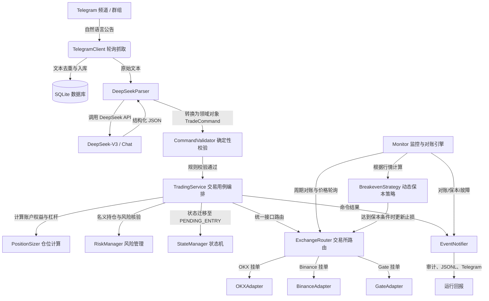

# CryptoTrade 代码架构与功能全景图 (CodeMap)

本文档系统性地梳理了 **CryptoTrade** 项目的整体架构设计、模块划分、数据流向、核心业务逻辑以及各源码文件的详细职责，作为代码库的权威索引与开发指南。

---

## 1. 架构总览 (Architecture Overview)

CryptoTrade 是一个由 Telegram 公告/频道信号驱动的多交易所（OKX、Binance、Gate）永续合约自动化交易与风险管理系统。

### 1.1 系统核心数据流向



---

## 2. 模块与文件索引 (Module & File Index)

### 2.1 核心入口与应用层

| 文件 | 核心类 / 函数 | 职责与功能说明 |
| :--- | :--- | :--- |
| [`main.py`](file:///f:/projects/CryptoTrade/main.py) | `Application`, `async_main`, `main` | **程序主入口**：负责初始化数据库、多交易所路由、监控器、DeepSeek 解析器与 Telegram 客户端；支持 `--dev` 开发测试参数；捕获退出信号并优雅停机。 |
| [`dev_runner.py`](file:///f:/projects/CryptoTrade/dev_runner.py) | `run_dev_test` | **开发者测试套件**：支持通过 `python main.py --dev` 调试 DeepSeek API 连通性、打印原始返回与结构化实体，并端到端完成本地模拟开仓。 |
| [`settings.py`](file:///f:/projects/CryptoTrade/settings.py) | `Settings`, `_load_dotenv` | **配置管理与密钥隔离**：轻量读取 `.env` 环境变量与 `config.yaml` 配置文件，提供强类型配置属性访问。 |
| [`exchanges/credentials.py`](file:///f:/projects/CryptoTrade/exchanges/credentials.py) | `credentials` | **环境凭据隔离**：严格按交易所模式读取 `*_DEMO_*`、`*_TESTNET_*` 或 `*_LIVE_*` 变量，允许同一 `.env` 保存两套凭据而不混用。 |
| [`app_logging.py`](file:///f:/projects/CryptoTrade/app_logging.py) | `configure_logging`, `JsonlFormatter` | **结构化日志系统**：配置控制台与文件日志输出，记录结构化 JSONL 运行轨迹。 |
| [`notifications.py`](file:///f:/projects/CryptoTrade/notifications.py) | `EventNotifier` | **运行通知中心**：将启动对账、命令结果、保本和保护单故障同步写入审计日志、JSONL 与 Telegram 回报。 |

---

### 2.2 大模型解析与业务校验层

| 文件 | 核心类 / 函数 | 职责与功能说明 |
| :--- | :--- | :--- |
| [`deepseek_parser.py`](file:///f:/projects/CryptoTrade/deepseek_parser.py) | `DeepSeekParser`, `command_from_json`, `_extract_json` | **【当前默认解析器】**：通过官方 DeepSeek API 调用 `deepseek-chat` 模型，将自然语言交易公告解析为无歧义的 `TradeCommand` 结构化指令。 |
| [`codex_parser.py`](file:///f:/projects/CryptoTrade/codex_parser.py) | `CodexParser`, `resolve_command` | **【备用解析器】**：通过本机安装的 Codex CLI 子进程进行交易公告识别（已停用，代码保留备用）。 |
| [`validator.py`](file:///f:/projects/CryptoTrade/validator.py) | `CommandValidator`, `ValidationError` | **确定性业务校验器**：任何大模型输出必须经过此层校验。检查交易所白名单、币种白名单、置信度阈值、多空进场价/止盈止损逻辑合理性等。 |

---

### 2.3 交易执行、资金与风控层

| 文件 | 核心类 / 函数 | 职责与功能说明 |
| :--- | :--- | :--- |
| [`trading_service.py`](file:///f:/projects/CryptoTrade/trading_service.py) | `TradingService` | **交易用例编排层**：负责指令幂等落库、账户权益获取、动态名义仓位计算、风险检查、进场限价挂单，以及基于 `trade_id` 远端核对的改挂单、撤单、止损恢复和市价平仓。 |
| [`position_sizer.py`](file:///f:/projects/CryptoTrade/position_sizer.py) | `PositionSizer` | **资金管理与仓位计算**：根据配置的保证金比例（默认账户权益 2%）与杠杆倍数（默认 100x）计算实际开仓标的数量。 |
| [`risk_manager.py`](file:///f:/projects/CryptoTrade/risk_manager.py) | `RiskManager`, `RiskExceededError` | **风控检查**：对指令名义价值进行上限校验（如不得超过账户权益的 2 倍），超出即熔断拒绝。 |
| [`breakeven_strategy.py`](file:///f:/projects/CryptoTrade/breakeven_strategy.py) | `calculate_breakeven`, `should_trigger`, `stop_only_improves` | **动态保本策略计算**：计算盈利进度达 50%（或自定义比例）时的触发价格，并将止损单动态抬升/下移至进场价上方 1% 处锁定利润。 |
| [`state_manager.py`](file:///f:/projects/CryptoTrade/state_manager.py) | `StateManager` | **交易状态机管理**：管理单笔交易在生命周期中的状态流转（`RECEIVED` $\to$ `PENDING_ENTRY` $\to$ `OPEN` $\to$ `CLOSED` 等）。 |

---

### 2.4 交易所适配与路由层

| 文件 | 核心类 / 函数 | 职责与功能说明 |
| :--- | :--- | :--- |
| [`exchange_router.py`](file:///f:/projects/CryptoTrade/exchange_router.py) | `ExchangeRouter` | **交易所路由分发**：屏蔽底层交易所差异，根据指令中的交易所枚举将操作分发给对应的 Adapter；支持实盘保护开关（`ALLOW_LIVE_TRADING`）。 |
| [`exchanges/base.py`](file:///f:/projects/CryptoTrade/exchanges/base.py) | `ExchangeAdapter` (抽象基类), `PaperAdapter` (本地模拟盘) | **统一适配器接口规范**：定义获取权益、获取合约信息、下单（含附带 TP/SL）、撤单、持仓查询等统一抽象异步方法。 |
| [`exchanges/okx.py`](file:///f:/projects/CryptoTrade/exchanges/okx.py) | `OKXAdapter` | **OKX 官方对接适配器**：支持 OKX 模拟盘（Demo）与实盘（Live），下单前查询具体合约的实际杠杆上限并自动下调，避免 59102 拒单；结合标记价校验可能成交价与附带 TP/SL 的方向，提前拦截币种价格错配及 51051；实现基于 HMAC-SHA256 的请求签名认证与永续合约交互。 |
| [`exchanges/binance.py`](file:///f:/projects/CryptoTrade/exchanges/binance.py) | `BinanceAdapter` | **Binance 官方对接适配器**：支持 Binance USDⓈ-M Futures 测试网（Testnet）与实盘，处理基于 Timestamp/HMAC 的交易接口。 |
| [`exchanges/gate.py`](file:///f:/projects/CryptoTrade/exchanges/gate.py) | `GateAdapter` | **Gate.io 官方对接适配器**：支持 Gate Futures 测试网与实盘，实现标准 API 签名与合约下单。 |

---

### 2.5 监控、通讯与数据存储层

| 文件 | 核心类 / 函数 | 职责与功能说明 |
| :--- | :--- | :--- |
| [`monitor.py`](file:///f:/projects/CryptoTrade/monitor.py) | `Monitor` | **后台监控与启动对账引擎**：系统启动时按数量精确关联本地交易与远程仓位并恢复可监控交易；消费订单/行情事件，触发动态保本与保护单故障通知。 |
| [`telegram_client.py`](file:///f:/projects/CryptoTrade/telegram_client.py) | `TelegramClient` | **Telegram 接口交互**：使用 Telegram Bot API 长轮询接收频道/群组新消息，支持发送交易执行结果回报。 |
| [`database.py`](file:///f:/projects/CryptoTrade/database.py) | `Database` | **SQLite 数据持久化**：启用 WAL 模式和外键约束，管理消息、交易实例、订单、持仓快照、指令与审计日志表。 |

---

### 2.6 领域模型与模式定义

| 文件 | 核心类 / 规范 | 职责与功能说明 |
| :--- | :--- | :--- |
| [`models.py`](file:///f:/projects/CryptoTrade/models.py) | `TradeCommand`, `EntrySpec`, `BreakevenSpec`, `Instrument`, `OrderRequest`, `OrderResult`, `PositionSnapshot`, `ASSET_ALIASES`, `normalize_asset` 等 | **统一领域实体定义**：所有金额与价格统一采用高精度 `Decimal`，严格定义各类枚举；`OrderRequest` 支持携带 `take_profit_price` 与 `stop_loss_price`；`ASSET_ALIASES` 字典与 `normalize_asset()` 函数提供中文/英文别名（如"黄金"→XAU、"大饼"→BTC）到标准 Ticker 代码的映射。 |
| [`schemas/trade_command.schema.json`](file:///f:/projects/CryptoTrade/schemas/trade_command.schema.json) | JSON Schema 规范 | **指令交互协议**：定义大模型结构化输出的严格 JSON 字段结构与约束。 |

---

## 3. 核心数据表结构 (Database Schema)

系统在 SQLite 中维护如下关键表：

```
telegram_messages   -- Telegram 原始消息记录与解析缓存（以 chat_id, message_id 为主键去重）
trade_instances     -- 交易生命周期实例表（记录 trade_id, 状态, 是否触发保本）
orders              -- 订单明细表（记录交易所 order_id、委托数量、累计实际成交量、成交均价和状态）
positions           -- 持仓快照表（用于启动对账与持仓监控）
commands            -- 指令幂等执行表（记录 command_id, 状态, 载荷 JSON）
exchange_events     -- 交易所事件日志表
audit_logs          -- 全流程审计跟踪表（记录前置/后置状态与操作结果）
runtime_state       -- 系统运行时状态持久化键值表
```

---

## 4. 关键配置与环境变量说明

### 4.1 配置文件 (`config.yaml`)

```yaml
telegram:
  enabled: true
  poll_timeout_seconds: 30
  report_chat_id: null

notifications:
  enabled: true
  send_info: true
  send_warnings: true
  send_critical: true

# 默认使用 DeepSeek API 进行自然语言交易公告解析
deepseek:
  api_key: ""                      # 留空时从环境变量 DEEPSEEK_API_KEY 读取
  base_url: "https://api.deepseek.com"
  model: "deepseek-chat"
  timeout_seconds: 30
  minimum_confidence: "0.90"

trading:
  default_exchange: OKX            # 公告未指定交易所时的默认目标
  asset_whitelist: [BTC, ETH, SOL, XAU, PAXG, XAUT] # 交易币种白名单（支持中文别名自动映射）
  position_margin_ratio: "0.02"    # 每笔交易使用账户权益的 2% 作为保证金
  leverage: "100"                  # 杠杆倍数（100倍杠杆对应名义仓位为权益的 2 倍）
  new_positions_enabled: true
  market_type: USDT_PERPETUAL

exchanges:
  OKX:
    enabled: true
    mode: DEMO                     # DEMO=OKX 官方模拟盘, LIVE=实盘, LOCAL=仅本地模拟
  BINANCE:
    enabled: true
    mode: TESTNET                  # TESTNET=Binance 测试网, LIVE=实盘, LOCAL=仅本地模拟
  GATE:
    enabled: true
    mode: TESTNET                  # TESTNET=Gate 测试网, LIVE=实盘, LOCAL=仅本地模拟
```

### 4.2 环境变量 (`.env`)

- `DEEPSEEK_API_KEY`: DeepSeek 官方 API 密钥（**优先推荐**）。
- `TELEGRAM_BOT_TOKEN`: 用于接收公告和发送回报的 Telegram Bot Token。
- `ALLOW_LIVE_TRADING`: 实盘保护总开关（必须显式设为 `true` 才能以 `LIVE` 模式启动）。
- `OKX_DEMO_API_KEY` / `OKX_LIVE_API_KEY`（及对应 Secret、Passphrase）：OKX 模拟盘/实盘凭据。
- `BINANCE_TESTNET_API_KEY` / `BINANCE_LIVE_API_KEY`（及对应 Secret）：Binance 测试网/实盘凭据。
- `GATE_TESTNET_API_KEY` / `GATE_LIVE_API_KEY`（及对应 Secret）：Gate 测试网/实盘凭据。

---

## 5. 测试套件与质量保证

项目采用 `pytest` + `pytest-asyncio` 进行全覆盖测试：

```bash
# 执行全部单元测试与集成测试
py -m pytest
```

测试文件划分：
- [`tests/test_core.py`](file:///f:/projects/CryptoTrade/tests/test_core.py)：核心交易逻辑、资金比例计算、保本策略与订单幂等性测试。
- [`tests/test_deepseek_parser.py`](file:///f:/projects/CryptoTrade/tests/test_deepseek_parser.py)：DeepSeek API 解析器 Mock 测试、JSON 提取兼容性测试与异常捕获测试。
- [`tests/test_dev_runner.py`](file:///f:/projects/CryptoTrade/tests/test_dev_runner.py)：开发者测试模式（`--dev`）端到端模拟下单与输出断言测试。
- [`tests/test_okx_errors.py`](file:///f:/projects/CryptoTrade/tests/test_okx_errors.py)：交易所错误码处理与网络重试逻辑测试。
- [`tests/test_telegram_config.py`](file:///f:/projects/CryptoTrade/tests/test_telegram_config.py)：Telegram 配置加载与消息解析验证。
- [`tests/test_credentials.py`](file:///f:/projects/CryptoTrade/tests/test_credentials.py)：模拟盘与实盘凭据严格隔离测试。
- [`tests/test_notifications.py`](file:///f:/projects/CryptoTrade/tests/test_notifications.py)：通知审计、级别开关和 Telegram 回报格式测试。

---

## 6. 当前未完成能力与开发顺序

以下能力尚未完成或尚未接通，按风险优先级维护：

1. **自动保本策略执行**：已接入 OKX、Binance、Gate 行情事件；对于本地已跟踪的止损单，达到目标进度后会按真实持仓均价创建更优止损、撤销旧止损，并持久化 `breakeven_triggered`。旧版 OKX 原子附带保护单尚未保存可撤销的 Algo ID，因此不会猜测并修改该类订单。
2. **启动后的持仓恢复**：启动对账会刷新仓位快照，并且仅在“交易所 + 合约 + 方向”下本地进场数量之和与远程仓位精确一致、且没有仍开放的进场单时恢复为 `OPEN`、补建非原子保护单及继续保本监控；未关联或数量不一致的远程持仓只告警，绝不猜测归属。跨设备/清库后的历史订单重建仍未实现。
3. **多笔同币种交易的精确关联**：已以本地 `trade_id` 的进场数量作为汇总仓位分配账本；自动保本仅在同一“交易所 + 合约 + 方向”下所有活动交易的数量之和与远程仓位精确一致时逐笔执行，否则记录审计并停止自动操作。跨设备/人工交易导致的数量差异仍需人工处置。
4. **人工 Telegram 指令**：已开放 `AMEND_ENTRY`（仅未成交挂单）、`CANCEL_ORDER`（未成交时撤进场、已开仓时取消止损）、`MOVE_STOP`（改止损或恢复止损）与明确的 `CLOSE_POSITION` 市价平仓。每项均要求完整 `trade_id`，并核对交易所、合约、方向和远程订单/仓位；不能唯一关联则拒绝。修改止盈、补仓及“保本离场”改止盈仍待实现。
5. **通知与可观测性**：已将启动对账、命令结果、保本移动、保护单失败和停机事件写入 SQLite 审计、JSONL 日志并按级别发送 Telegram 回报；尚未提供审计查询 CLI 或周期性运行摘要。
6. **成交与事件安全性**：部分成交使用交易所累计成交量创建并随成交扩大而替换保护单；部分成交时拒绝撤余单；行情 ticker 不再逐条写入 SQLite；关闭时会等待已接收的 Telegram 指令完成。OKX 原子附带保护单的 Algo ID 查询/撤销关联仍待补齐，相关人工操作会安全拒绝。

解析器文档已统一：`DeepSeekParser` 是默认运行链路，`codex_parser.py` 仅作为停用的备用实现保留。

### 6.1 已完成的最高优先级闭环：成交状态与保护单

`Monitor` 现会从 OKX、Binance、Gate 的订单 WebSocket 事件提取客户订单号和订单状态，并同步本地 `orders` 与交易状态。开仓完整成交后：

- OKX 使用开仓请求中的 `attachAlgoOrds` 原子附带止盈止损；
- Binance、Gate 按交易所返回的实际持仓数量创建只减仓的止盈、止损单，并写入订单与审计日志；
- 保护单创建失败时将交易置为 `ERROR_LOCKED`，阻止后续自动操作并输出高优先级日志。

## 7. 开发者测试模式使用指南

无需启动 Telegram 轮询，直接在终端执行端到端链路测试：

```bash
# 使用默认测试信号进行 DeepSeek API 识别并执行模拟下单
python main.py --dev

# 使用自定义公告文本进行测试
python main.py --dev --signal "做多 BTC 60000-60500 止损 59000 止盈 62000"
```
